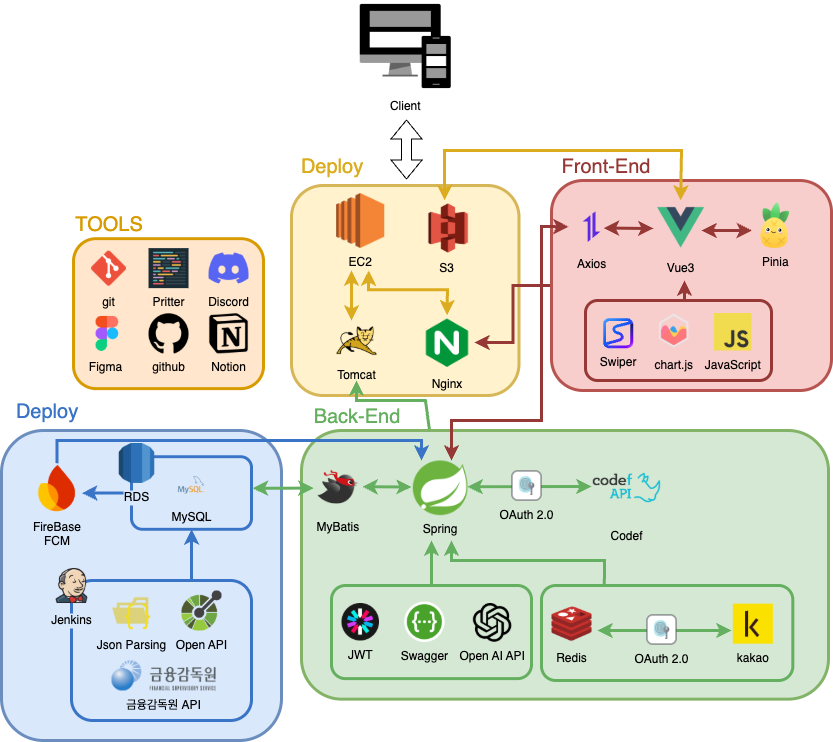

<div align="center">

# 💰 MatchuMoney 💰

<h3>🎯 나에게 딱 맞는 금융상품을 찾아주는 스마트한 추천 플랫폼</h3>

<br>


<br><br>

### 🌟 복잡한 금융상품 선택, 이제 MatchuMoney가 해결해드릴게요!
### 🔥 machumoney의 motive
**모든 고객들에게 맞춤 금융 상품을 제공하자** 에서 시작을 하였습니다.

</div>

---

## 🎯 프로젝트 소개

**MatchuMoney**는 개인의 **소비 패턴**과 **금융 성향**을 분석하여  
가장 적합한 **카드**, **예금**, **적금** 상품을 추천해주는 개인화 금융 플랫폼입니다.

### 💡 왜 MatchuMoney인가요?

```
🤔 "내게 맞는 카드가 뭐지?"           →  🎯 소비패턴 기반 맞춤 카드 추천
😵 "예적금이 너무 많아서 모르겠어"    →  🔍 조건별 맞춤 상품 비교/검색  
💭 "내 금융 성향이 궁금해"           →  🎭 재미있는 페르소나 진단 테스트
📱 "복잡한 금융용어는 어려워"        →  🤖 친근한 AI 챗봇 금융상담
```

### ✨ 주요 특징

🎯 **개인 맞춤형 추천 시스템**  
실제 거래내역과 페르소나 분석을 통해 나만을 위한 금융상품 추천

📊 **마이데이터 기반 분석**  
코드에프 API로 예금·적금·KB카드 실 거래내역을 분석하여 소비 패턴 시각화

🎭 **8가지 동물 페르소나**  
개미, 고양이, 올빼미 등 귀여운 캐릭터로 표현하는 나의 금융 성향

🏦 **통합 금융상품 비교**  
전국 은행의 카드·예금·적금 상품을 한 곳에서 비교 검색

🎮 **재미있는 금융 교육**  
퀴즈, 웹툰, 금전운으로 배우는 즐거운 금융 지식

🤖 **AI 금융 상담 챗봇**  
OpenAI 기반 실시간 금융 상담 및 질답 서비스

---

## 🏗️ 시스템 아키텍처



---

## 🎪 주요 기능 소개

<table>
<tr>
<td width="50%">

### 🎭 페르소나 진단 테스트


- **개미** 🐜: 알뜰한 저축왕
- **고양이** 🐱: 자유로운 소비성향  
- **올빼미** 🦉: 신중한 투자형
- **펭귄** 🐧: 안정 추구형
- **토끼** 🐰: 빠른 결정형
- **다람쥐** 🐿️: 준비하는 미래형
- **호랑이** 🐅: 적극적 도전형
- **거북이** 🐢: 천천히 확실하게형

</td>
<td width="50%">

### 💳 스마트 카드 추천


- 실제 소비내역 기반 분석
- 카테고리별 혜택 시뮬레이션  
- 연회비 대비 혜택 효율성 계산
- 사용자별 맞춤 카드 순위 제공

### 🏦 예적금 통합 비교


- 실시간 금리 정보 제공
- 조건별 필터링 및 정렬
- 상품별 상세 비교 분석

</td>
</tr>
</table>

### 🎮 게임화 금융 교육

| 기능            | 설명               |
|---------------|------------------|
| 🧩 **일일 퀴즈**  | 매일 새로운 금융 상식 퀴즈  |
| 📚 **웹툰 콘텐츠** | 재미있는 금융 교육 웹툰    |
| 🎯 **캐릭터 진화** | 꾸준한 학습을 위한 보상 |
| 🏆 **경험 시스템** | 학습 활동 기반 포인트 적립  |

### 📊 마이데이터 분석 대시보드

```
📈 월별 소비 패턴 분석    📊 카테고리별 지출 현황    💰 절약 인사이트 제공
```

---

## 🎨 주요 화면 구성

<div align="center">

| 🏠 메인 홈 | 🎭 페르소나 테스트 |        💳 예금·적금카드 추천         | 📊 마이데이터 분석 |
|:----------:|:----------------:|:----------------------------:|:-----------------:|
| 개인화 대시보드<br/>추천 상품 요약 | 8가지 동물 진단<br/>성향별 결과 | 맞춤 예금·적금·카드 리스트<br/>혜택 분석 추천 | 소비 패턴 차트<br/>인사이트 제공 |

</div>

---

## 👥 팀원 소개

<div align="center">

**KB IT's Your Life 6기 2팀** 🏆

*2025년 7월 ~ 8월 (6주간) 진행된 최종 프로젝트*

</div>

<div align="center" style="display: flex; flex-wrap: wrap; justify-content: center; gap: 20px;">

<div style="display: flex; flex-direction: column; align-items: center; width: 180px; text-align: center;">

<h4 style="margin: 5px 0; color: #40513b;">강병선</h4>
<span style="background: #609966; color: white; padding: 4px 8px; border-radius: 12px; font-size: 12px; margin-bottom: 10px; font-weight: bold;">PM</span>
<div style="font-size: 12px; line-height: 1.4; margin-bottom: 10px;">
• 데이터베이스 구축<br/>
• API 데이터 분석 및 데이터 정제<br/>
• 보유 카드 소비 기반 카드 상품 추천<br/>
• 일일 금융 퀴즈<br/>
• Jenkins 기반 데이터 스케줄러
</div>
<a href="https://github.com/byesun" style="background: #40513b; color: white; text-decoration: none; padding: 6px 12px; border-radius: 8px; font-size: 12px;">@byesun</a>
</div>

<div style="display: flex; flex-direction: column; align-items: center; width: 180px; text-align: center;">

<h4 style="margin: 5px 0; color: #40513b;">김혜진</h4>
<span style="background: #609966; color: white; padding: 4px 8px; border-radius: 12px; font-size: 12px; margin-bottom: 10px; font-weight: bold;">Front-End Lead</span>
<div style="font-size: 12px; line-height: 1.4; margin-bottom: 10px;">
• UI/UX Design<br/>
• 보유 잔액 기반 예금 상품 추천<br/>
• 메인 화면 및 헤더 구현<br/>
• 금융 교육 웹툰 게시판
</div>
<a href="https://github.com/chol644" style="background: #40513b; color: white; text-decoration: none; padding: 6px 12px; border-radius: 8px; font-size: 12px;">@chol644</a>
</div>

<div style="display: flex; flex-direction: column; align-items: center; width: 180px; text-align: center;">

<h4 style="margin: 5px 0; color: #40513b;">남민주</h4>
<span style="background: #609966; color: white; padding: 4px 8px; border-radius: 12px; font-size: 12px; margin-bottom: 10px; font-weight: bold;">Developer</span>
<div style="font-size: 12px; line-height: 1.4; margin-bottom: 10px;">
• 페르소나 캐릭터 디자인<br/>
• UI/UX Design<br/>
• 보유 적금 기반 적금 상품 추천<br/>
• 금융 교육 영상 게시판<br/>
• 비교함 기능 구현
</div>
<a href="https://github.com/namminju" style="background: #40513b; color: white; text-decoration: none; padding: 6px 12px; border-radius: 8px; font-size: 12px;">@namminju</a>
</div>

<div style="display: flex; flex-direction: column; align-items: center; width: 180px; text-align: center;">

<h4 style="margin: 5px 0; color: #40513b;">박채연</h4>
<span style="background: #609966; color: white; padding: 4px 8px; border-radius: 12px; font-size: 12px; margin-bottom: 10px; font-weight: bold;">Developer</span>
<div style="font-size: 12px; line-height: 1.4; margin-bottom: 10px;">
• UI/UX Design<br/>
• 페르소나 기반 금융 상품 추천<br/>
• 금융 상품 카테고리별 필터링 기능<br/>
• 비교함 기능 구현
</div>
<a href="https://github.com/maedachaeva" style="background: #40513b; color: white; text-decoration: none; padding: 6px 12px; border-radius: 8px; font-size: 12px;">@maedachaeva</a>
</div>

<div style="display: flex; flex-direction: column; align-items: center; width: 180px; text-align: center;">

<h4 style="margin: 5px 0; color: #40513b;">배성현</h4>
<span style="background: #609966; color: white; padding: 4px 8px; border-radius: 12px; font-size: 12px; margin-bottom: 10px; font-weight: bold;">Back-End Lead</span>
<div style="font-size: 12px; line-height: 1.4; margin-bottom: 10px;">
• 로그인/회원가입 보안 설정<br/>
• 마이페이지<br/>
• 사용자별 상품 즐겨찾기
</div>
<a href="https://github.com/tjdgus3488" style="background: #40513b; color: white; text-decoration: none; padding: 6px 12px; border-radius: 8px; font-size: 12px;">@tjdgus3488</a>
</div>

<div style="display: flex; flex-direction: column; align-items: center; width: 180px; text-align: center;">

<h4 style="margin: 5px 0; color: #40513b;">임형섭</h4>
<span style="background: #609966; color: white; padding: 4px 8px; border-radius: 12px; font-size: 12px; margin-bottom: 10px; font-weight: bold;">Developer</span>
<div style="font-size: 12px; line-height: 1.4; margin-bottom: 10px;">
• API 데이터 분석<br/>
• 페르소나 기반 금융 상품 추천<br/>
• 금융 상품 카테고리 별 필터링 기능<br/>
• 금융 교육 콘텐츠 게시판<br/>
• OpenAI 기반 챗봇 구현
</div>
<a href="https://github.com/hyeongseob01" style="background: #40513b; color: white; text-decoration: none; padding: 6px 12px; border-radius: 8px; font-size: 12px;">@hyeongseob01</a>
</div>

</div>

---

## 🛠️ 기술 스택

<div align="center">

### Backend


### Frontend  


### Database & Infra


### External APIs


</div>

---

## 📅 프로젝트 개발 일정

<div align="center">

| 📆 **주차** | 🎯 **주요 활동** |                        ✅ **완료 내용**                         |
|:-----------:|:---------------:|:----------------------------------------------------------:|
| **1주차**<br/>*7월 1주* | 프로젝트 기획 및 설계 |          • 요구사항 정의<br/>• ERD 설계<br/>• API 명세서 작성           |
| **2주차**<br/>*7월 2주* | 개발 환경 구축 | • Spring MVC 프로젝트 세팅<br/>• Vue.js 프로젝트 초기화<br/>• 데이터베이스 구축 |
| **3주차**<br/>*7월 3주* | 핵심 기능 개발 (1) |         • 회원가입/로그인<br/>• 페르소나 테스트<br/>• 기본 UI 컴포넌트         |
| **4주차**<br/>*7월 4주* | 핵심 기능 개발 (2) |      • 마이데이터 연동<br/>• 예금·적금·카드 추천 시스템<br/>• 예적금 비교 기능      |
| **5주차**<br/>*8월 1주* | 통합 및 테스트 |         • 프론트-백엔드 연동<br/>• 기능별 통합 테스트<br/>• 버그 수정          |
| **6주차**<br/>*8월 2주* | 배포 및 마무리 |           • 최종 테스트<br/>• 시연 영상 제작<br/>• 발표 준비 🚀           |

</div>

---

## 🏆 프로젝트 성과 및 특징

<div align="center">

### 🎯 **우리가 해결한 문제들**

</div>

<table>
<tr>
<td width="50%" align="center">

### 😵‍💫 **Before MatchuMoney**
```
❌ 수백 개의 카드 중 어떤 게 나에게 맞는지 모름
❌ 은행마다 다른 예적금 조건 비교하기 어려움  
❌ 내 소비 패턴을 정확히 파악하기 힘듦
❌ 복잡한 금융 용어와 정보의 홍수
❌ 금융 공부는 어렵고 재미없음
```

</td>
<td width="50%" align="center">

### 🎉 **After MatchuMoney**
```
✅ 페르소나 + 소비패턴 분석으로 맞춤 추천
✅ 전국 은행 상품을 한 곳에서 쉽게 비교
✅ 실제 거래내역 기반 정확한 소비 분석  
✅ 친근한 AI 챗봇이 쉽게 설명
✅ 퀴즈와 웹툰으로 재미있게 금융 학습
```

</td>
</tr>
</table>

---

## 📊 프로젝트 주요 수치

<div align="center">

<table>
<tr>
<td align="center"><strong>🎭</strong><br/>페르소나 유형</td>
<td align="center"><strong>💳</strong><br/>카드 상품 수</td>
<td align="center"><strong>🏦</strong><br/>연동 은행</td>
<td align="center"><strong>🤖</strong><br/>AI 챗봇 대화</td>
</tr>
<tr>
<td align="center"><strong>8가지</strong><br/>동물 캐릭터</td>
<td align="center"><strong>1000+</strong><br/>개 이상</td>
<td align="center"><strong>10+</strong><br/>개 은행</td>
<td align="center"><strong>실시간</strong><br/>상담 가능</td>
</tr>
</table>

</div>

## 🎨 디자인 콘셉트

<div align="center">

### 🌈 **사용자 친화적이고 직관적인 디자인**

**"복잡한 금융을 간단하고 재미있게"**

🎭 **캐릭터 중심 UI** • 8가지 동물 페르소나로 친근함 연출  
🎨 **모던한 디자인** • 실제 1만원권 지폐 색상 기반 깔끔하고 세련된 인터페이스  
📱 **반응형 웹** • 모바일/태블릿/데스크톱 모든 디바이스 지원  
📊 **직관적 시각화** • Chart.js 기반 이해하기 쉬운 그래프와 차트  

</div>

## 🎥 시연 영상

**시연 영상 ▶️** 
<a href="https://www.youtube.com/watch?v=gcUIEoC1grI&feature=youtu.be">Machumoney 시연영상 보러가기</a>

---

## 💝 마무리 인사

<div align="center">

### 🎯 **MatchuMoney** - 당신의 현명한 금융 동반자

<br/>

> *"복잡한 금융상품 선택, 더 이상 혼자 고민하지 마세요!"*  
> *"MatchuMoney가 당신만을 위한 맞춤형 솔루션을 제공합니다."*

<br/>

**KB IT's Your Life 6기 2팀**이 6주간 열정을 다해 개발한  
**개인화 금융상품 추천 플랫폼**입니다.

<br/>

### 🌟 **함께 만들어갈 미래**

더 많은 사용자들이 현명한 금융 선택을 할 수 있도록  
지속적으로 발전시켜 나가겠습니다!

<br/>

---


**⭐ 이 프로젝트가 마음에 드셨다면 Star를 눌러주세요! ⭐**

</div>
